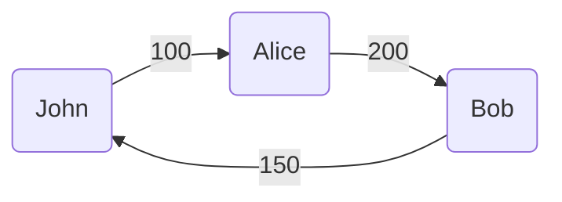
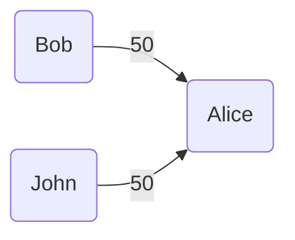

# Fair split

Calculate efficient way to return money based on borrowing history.

Tested using property-based testing with [jqwik](https://github.com/jlink/jqwik).

### Example

Columns: `From, To, Amount`.

Input file:
```csv
John, Alice, 100
Alice, Bob, 200
Bob, John, 150
```

Output file:
```csv
Bob, Alice, 50
John, Alice, 50
```

**Diagrams**

- Input


- Output


### Build from source

```shell
mvn clean package
java -jar target/app.jar in.csv out.csv
```
