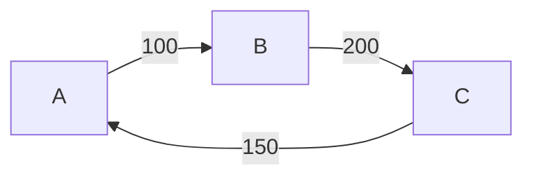

# Fair split

Calculate efficient way to return money based on borrowing history.



Tested using property-based testing with [jqwik](https://github.com/jlink/jqwik).

### Example

Columns: `From, To, Amount`.

Input file:
```csv
John, Alice, 100
Alice, Bob, 200
Bob, John, 150
```

Output file:
```csv
Bob, Alice, 50
John, Alice, 50
```

Use `--graph` option to create dot graphs.
Then use, for example, `dot -Tsvg in.csv.dot -o in.svg` to create svg from dot file.

For input and output from above, next diagrams will be produced:


### Build from source

Requires JDK 17.

```shell
mvn clean package
java -jar target/app.jar in.csv out.csv --graph
```

**To create native executable**

Install GraalVM:
```shell
sdk install java 22.0.0.2.r17-grl
gu install native-image
```

Build and run:
```shell
mvn clean package native-image:native-image
target/app in.csv out.csv --graph
```
